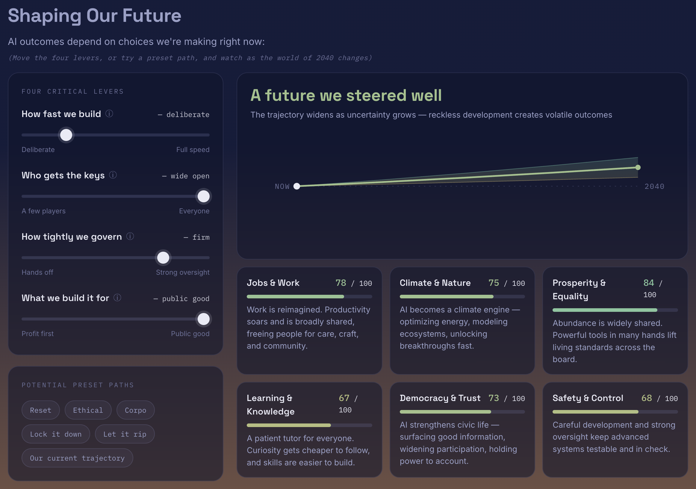

# AI Futures

**[→ View the live site](https://ai-futures-interactive.netlify.app/)**

An interactive, two-act exploration of AI's trajectory. Act One grounds the piece in three measured facts about where things stand today — model capability, data-center energy demand, and reported AI incidents. Act Two hands over four levers (pace, access, governance, purpose) and shows how they bend six domains of everyday life — jobs, climate, prosperity, learning, democracy, and safety — out to 2040.

It's built as a thinking tool, not a forecast: the math is deliberately simple and transparent, so the tradeoffs stay visible rather than hidden behind false precision.

## How it's built

The whole site is one static file — `site/index.html` — with all CSS and JS inline, no framework, no build step. Netlify serves the `site/` folder directly; every chart is hand-rolled SVG.

Act One's chart data isn't hardcoded in the page. `scripts/build_data.py` reads the raw sources in `data/raw/` and writes a single compact `site/data/processed/charts-data.js`, loaded via a plain `<script src>` tag (rather than `fetch()`) so the page still works if you just double-click it locally.

## Sources

- Epoch AI, *AI Benchmarking Hub* & *Machine Learning Trends* — [epoch.ai](https://epoch.ai/)
- IEA, *Energy and AI* (2025) — [iea.org](https://www.iea.org/data-and-statistics/data-product/energy-and-ai)
- McGregor, S. (2021), *AI Incident Database* — [incidentdatabase.ai](https://incidentdatabase.ai/)
- Stanford HAI, *2026 AI Index Report* — [hai.stanford.edu](https://hai.stanford.edu/ai-index/2026-ai-index-report)
- OECD, *AI Principles* — [oecd.ai](https://oecd.ai/en/ai-principles)

Full citations, including the sources behind each lever's tooltip, are in the page footer.

---

Created by Nicholas J. Sutherland · © 2026 · All Rights Reserved
